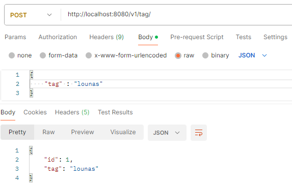
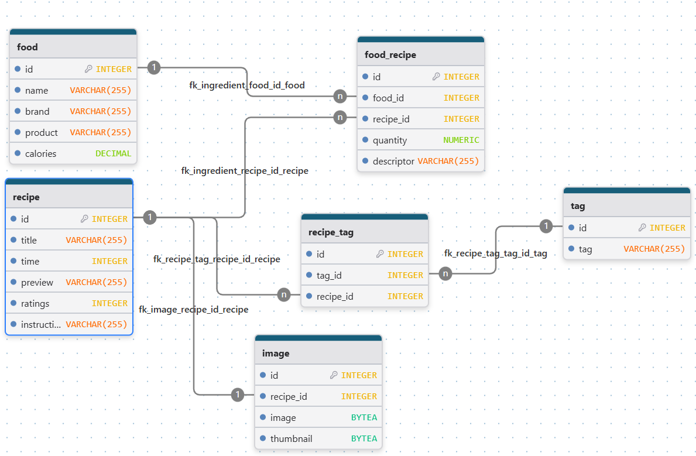
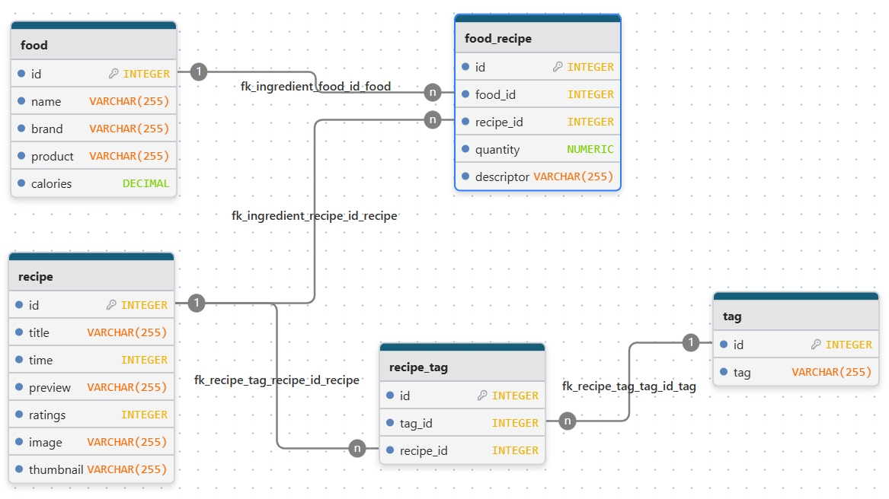
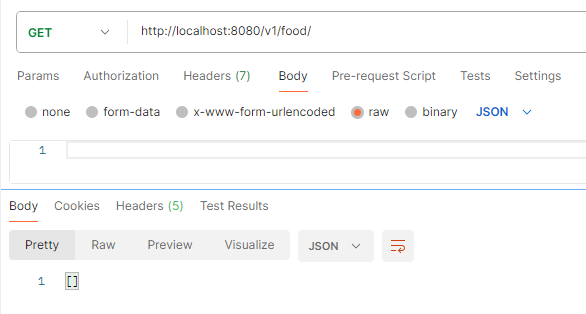
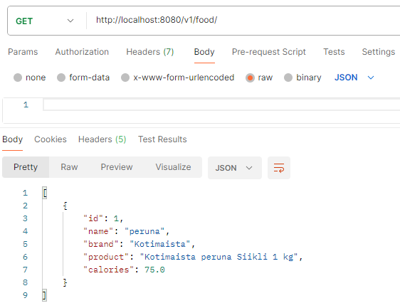
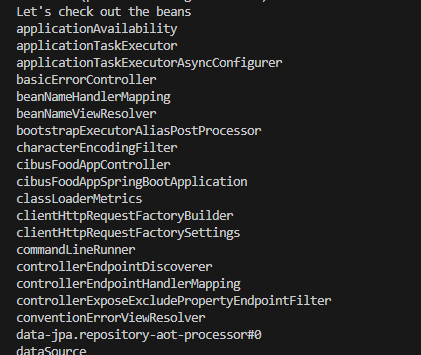

# cibus-food-app-spring-boot

Backend for Cibus Food App

## Log

2025

### November 17, 2025

Working on returning the tags with the recipes

### November 10, 2025

Added cors and getId to tags

### November 8, 2025

Worked on uniting the frontend with the backend.

Added Cors bean to RecipeController

### November 2nd, 2025

Added FoodRecipe migration table, controller, service and repository

### November 1st, 2025

Added the routes (controller), service, and repository for Tag

Added recipe AND recipe_tag migration tables, and the controllers, services and repositories

for recipeTag

Now only missing Image and FoodRecipe

### October 29, 2025

Removed Ingredient class (replaced by FoodRecipe class), edited other classes.

Included tag migration table

### October 28, 2025

Planned out the structure some more, made changes to existing files and created new files

For instance, made models for the planned out tables, and decided to make another table for images

### October 27, 2025

Planned out the structure of the database and removed unnecessary fields

### October 25, 2025

Created tables in PGAdmin. Added more attributes to Food model to allow for brand and product information.

Create the migration table for food, and now GET foods and POST food routes work.

GET when there was nothing in food table

POST first food

GET after first food was inserted

### October 24, 2025

Added Food, Ingredient and Recipe models. Restructured.

### October 21st, 2025

Connected PostgreSQL to backend, logging works now

### October 20, 2025

Created backend
