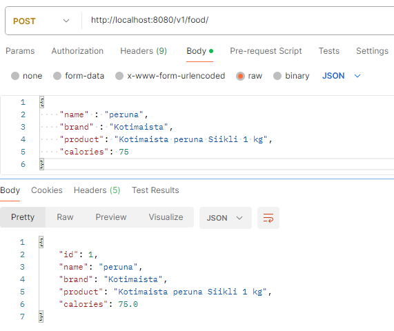

# cibus-food-app-spring-boot

Backend for Cibus Food App

## Log

### October 25, 2025

Created tables in PGAdmin. Added more attributes to Food model to allow for brand and product information.

Create the migration table for food, and now GET foods and POST food routes work.

GET when there was nothing in food table

POST first food

GET after first food was inserted

### October 24, 2025

Added Food, Ingredient and Recipe models. Restructured.

### October 21st, 2025

Connected PostgreSQL to backend, logging works now

### October 20, 2025

Created backend
